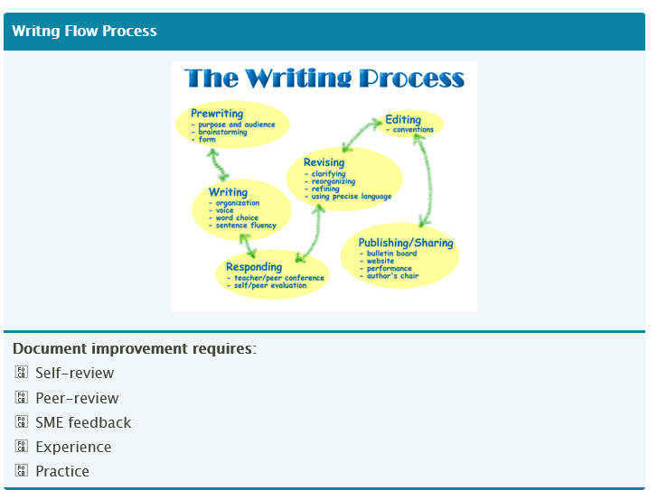

# Introduction

> Good technical docume­ntation doesn’t just happen. It’s a process that takes time to develop. 
    It can be compli­cated to write. And, it takes lots of practice to perfect. To be a profes­sional 
    technical writer, you need to be able to consis­tently produce good technical docume­ntation regardless 
    of the subject. The key to doing this is to know how to write and to understand the needs of your audience. 
    In addition, profes­sional technical writers must have a natural curiosity, be techni­cally adept, and have the 
    ability to follow up on details. In the hectic world of technical docume­ntation creation, flexib­ility is also 
    a necessary trait. Experi­enced technical writers are able to "­cou­rse­-co­rre­ct,­" as priorities change, without 
    breaking stride
--- 
# Planning 
> Planning. Know the purpose and scope of the project before you begin. The planning phase defines what needs to be accomp­lished, what regula­tions and style guides need to be followed, when the docume­ntation needs to be completed, identifies the delive­rables, considers what resources are available (internal, contract or outsou­rcing), and identifies the costs involved. Time spent up front planning tends to reduce the actual writing time for many technical docume­ntation projects.
---
# Drafting
> This is the phase where you outline your work. When developing the content outline, keep in mind that the user needs to be able to unders­tand, navigate, and find what you’ll be presen­ting. So that you don’t miss important content, start with a high-level outline on all topics to be covered. Then, begin gathering the specific content inform­ation and supporting graphics. Leave placeh­olders for any inform­ation gaps. When drafting proced­ures, do a self-r­eview to make sure you can perform each procedure as you’ve written it. Make adjust­ments as necessary.

---
#  Reviewing
> Typically, SME (Subject matter experts) formal reviews take place upon completion of a first draft and a final draft. Depending on the type of content you’re develo­ping, however, you may want the SME to check individual sections or topics. New content where the product inform­ation is still in flux, may take more reviews; existing content, may only need to be reviewed upon completion of the first draft.

---
#  Revising
> Once all revisions have been made to your initial draft, set up a peer review to test its accuracy. Testing your document with someone who was not involved with the develo­pment of the document may make it easier to identify some small factor that was overlooked previo­usly. Adjust the content as necessary, making sure that it is presented in a way that makes the content intuitive for your audience

---
#  Editing
> Adding a second set of eyes to the technical writing process increases the credib­ility and profes­sio­nalism of the entire process. As an indepe­ndent member of the docume­ntation team, the technical editor provides value-­added support to the technical writing effort by making sure the language has a logical flow, and the content is complete and consis­tent

---
# Publishing/Maintaing
> Once a document is signed-off by its reviewers, it’s ready for publis­hing. At this point, the document falls into a new status­—Ma­int­enance. As products evolve, it’s important that users continue to have accurate and complete inform­ation. To make sure this happens, docume­ntation must be reviewed on a regular basis and brought up to date. For FDA regulated companies, proper mainte­nance is critical to avoid warning letters from the FDA.

